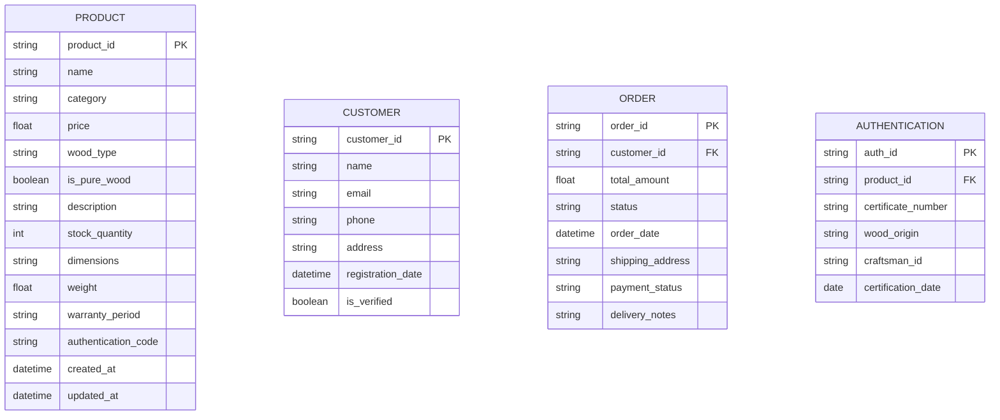

# 🪑 Premium Wooden Furniture E-commerce Marketplace
Market Place Builder Hackathon 2025 Project

Welcome to my wooden furniture e-commerce marketplace project, developed as part of the Market Place Builder Hackathon 2025. This platform specializes in authentic wooden furniture while accommodating diverse customer needs.

### 📋 Project Overview

**Type:** E-commerce Platform  
**Focus:** Premium Wooden Furniture  
**Status:** Day 1 - Foundation Phase

### 🎯 Business Goals

#### Problem Statement
We address several key market gaps:
- Limited access to verified authentic wooden furniture
- Lack of transparency in wood quality and sourcing
- Insufficient craftsmanship verification systems
- Need for customization options in premium furniture

#### Target Audience
- Home owners seeking quality wooden furniture
- Interior designers and decorators
- Traditional furniture enthusiasts
- Commercial space owners (offices, hotels, restaurants)
- Urban professionals (30-55 years) with medium to high income
- Quality-conscious consumers

### 🛍️ Product Offerings

#### Primary Collection (100% Wood)
- Bedroom Furniture
  - Beds
  - Wardrobes
  - Side Tables
- Living Room Furniture
  - Sofas
  - Coffee Tables
  - TV Units
- Dining Room Sets
- Office Furniture
- Storage Solutions
- Custom-made Pieces

#### Secondary Collection
- Mixed material furniture (wood + metal/glass)
- Upholstered furniture
- Outdoor wooden furniture
- Accessories and decor items

### ✨ Unique Features

1. **Authentication System**
   - Certificates for 100% wooden products
   - Wood type and origin tracking
   - Craftsmanship verification

2. **Customer Experience**
   - Virtual room planning
   - Professional installation
   - Extended warranty program
   - Sustainable sourcing verification

### 🏗️ Technical Architecture

Our platform is built on a robust data schema that manages:
- Product inventory and authentication
- Customer profiles and orders
- Reviews and ratings
- Image management
- Authentication certificates
- Order processing

#### Schema Overview

------------------

### 🛠️ Tech Stack

- Frontend: Next.js
- Database: (To be decided)
- Authentication: (To be decided)
- Payment Processing: (To be decided)
- Image Management: (To be decided)

### 📈 Development Roadmap

#### Phase 1 (Current)
- [x] Business Analysis
- [x] Data Schema Design
- [x] Market Research
- [ ] Tech Stack Finalization

#### Phase 2 (Upcoming)
- [ ] Frontend Development
- [ ] Backend API Development
- [ ] Database Implementation
- [ ] Authentication System

#### Phase 3 (Future)
- [ ] Payment Integration
- [ ] Admin Dashboard
- [ ] Customer Portal
- [ ] Product Management System

### 🤝 Contributing

This project is part of the Market Place Builder Hackathon 2025. While it's currently a personal project, suggestions and feedback are welcome through issues and discussions.

### 📝 License

[License details to be added]

*This project is part of the Market Place Builder Hackathon 2025. Follow the journey on LinkedIn [Hasnain Ahmed](https://www.linkedin.com/in/hasnainahmed90s/)*

### 📞 Contact

##### Name:- Hasnain Ahmed 
##### Roll No:- 00310538
##### Quarter:- 2
##### Batch:- 1
##### City:- Karachi
##### Centre:- Sindh Governor House Karachi
##### Campus:- Main
##### Days/Time:- Saturday 09:00 am - 12:00 pm

#### *Happy Coding*

[LinkedIn - Hasnain Ahmed](https://www.linkedin.com/in/hasnainahmed90s/)

[Governor Sindh Initiative for GenAI, Web3, and Metaverse](https://www.linkedin.com/company/governor-sindh-initiative/mycompany/)

___

### Batch-01

##### Name:- Hasnain Ahmed 
##### Roll No:- 00310538
##### Quarter:- 1
##### Batch:- 1
##### City:- Karachi
##### Centre:- Sindh Governor House Karachi
##### Campus:- Main
##### Days/Time:- Wednesday 09:00 am - 12:00 pm

---
